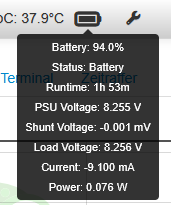
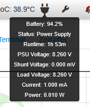
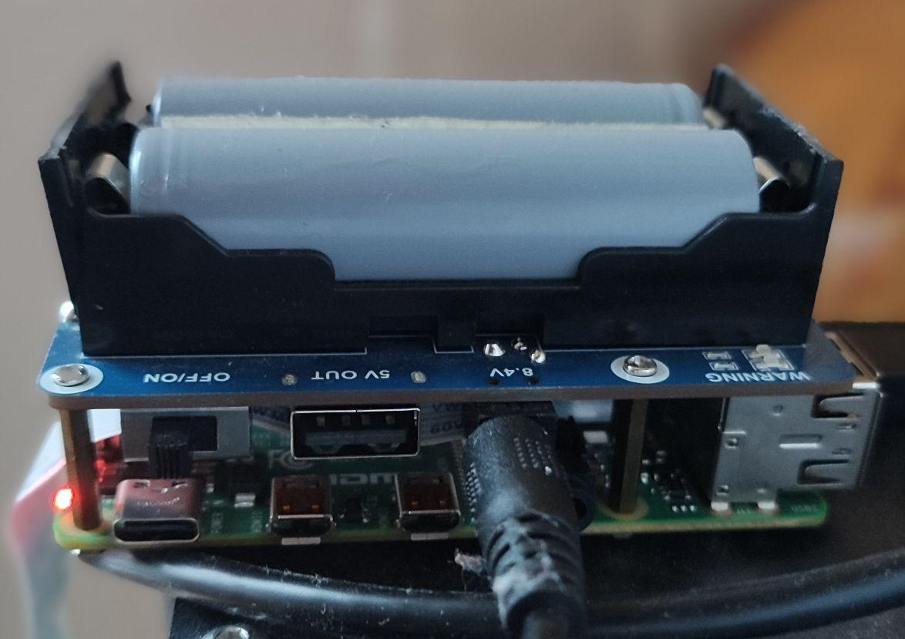

# OctoPrint-WaveshareUPS

This plugin displays a battery or power plug icon in the navigation bar. Hovering over the icon will show the current battery percentage, power supply status, and the remaining estimated runtime.

## Setup

Install via the bundled [Plugin Manager](https://docs.octoprint.org/en/master/bundledplugins/pluginmanager.html)
or manually using this URL:

    https://github.com/michaelszubartowicz/OctoPrint-WaveshareUPS/archive/main.zip

## Configuration

None. Make sure the device you are using has the Waveshare UPS Hat installed.

## Sources

The documentation of the product including sample code used in this repository can be found at https://www.waveshare.com/wiki/UPS_HAT. 

## Roadmap
### V0.1
- ensure basic functionality
- first public release
  
### V0.2
- add settings page to set thresholds and update frequency
- add setting to hide the advanced readings in the tooltip and make it hidden by default
- add percentage threshold and command to execute when the threshold was crossed while losing battery capacity (e.g., aborting the print job and shutting down the raspberry pi when power loss is imminent)
- (optional) add graphical settings (choice of symbol and colors)

### V0.3
- add message when power loss to UPS is detected. Detection may take some time as when full, the UPS will alternate between charging and discharging the battery
- change behavior of runtime estimation:
    - only shown when battery is not plugged in (see above)
    - runtime estimation based on linear interpolation of power draw based on the readings from the last minute
    - intention/possible use case: when a print job is running and the camera feed or gcode viewer are refreshed frequently, the higher power draw should be reflected in the estimated runtime when a power loss to the raspberry pi occurs
- compatibility with telegram plugin (send notifications, get status)

### V0.4 
- reserved for possible features and bug fixes from community